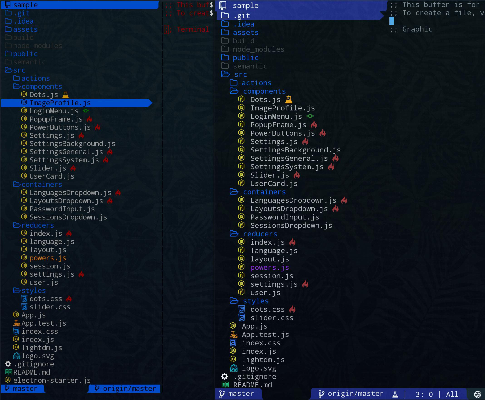
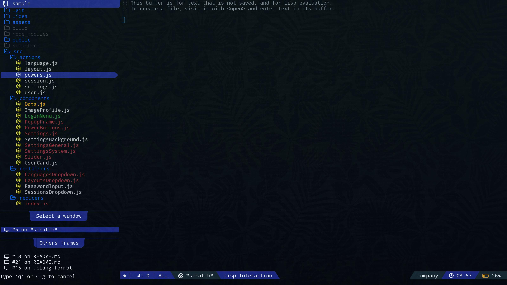

## Overview

`sidebar` is a customizable file explorer with git integration.  

I had few problems with others similar projects, so I wrote this one:  
- With the others, we're limited to 1 instance per emacs instance, it's annoying when we're using emacs daemon.  
  `sidebar` is written in a way to be able to open one sidebar for each frame.  
- We can't select in which window we want to open the file. it's possible with `sidebar`  

Everything is customizable.  
The icons are available on both GUI and terminal versions.  
Please give me your feedback and open issue for bugs.  

## Installation

Your first need to install [icons-in-terminal](https://github.com/sebastiencs/icons-in-terminal) (for both GUI and terminal).  
Follow the instructions for emacs integration.  

`sidebar` is not yet available on [MELPA](https://melpa.org/).  
I'm waiting for feedbacks to add it on melpa.  
  
```bash
$ git clone https://github.com/sebastiencs/sidebar.el.git
```
Add those lines in your emacs init file:
```el
(add-to-list 'load-path "~/.local/share/icons-in-terminal/") ;; If it's not already done
(add-to-list 'load-path "PATH-TO-SIDEBAR-DIRECTORY")
(require 'sidebar)
(global-set-key (kbd "C-x C-f") 'sidebar-open)
```

`sidebar` require some packages: `dash`,`s`, `projectile` and `loop`.  
You can install them through melpa.  

## Default commands

| Key     | Command                       | Note                                                    |
| --------|-------------------------------|---------------------------------------------------------|
| `RET`   | `sidebar-open-line`           | Open file or enter directory                            |
| `M-RET` | `sidebar-open-line-in-window` | Open file in a selected window                          |
| `C-d`   | `sidebar-deleted-selected`    | Delete the file                                         |
| `C-h`   | `sidebar-history`             | Open the history of visited directory                   |
| `C-n`   | `sidebar-create-directory`    | Create a directory                                      |
| `n`     | `sidebar-create-file`         | Create a file                                           |
| `C-w`   | `sidebar-cut-selected`        | Cut the file                                            |
| `M-w`   | `sidebar-copy-selected`       | Copy the file                                           |
| `C-y`   | `sidebar-paste`               | Paste the file                                          |
| `?`     | `sidebar-help`                | Open `describe-mode`                                    |
| `R`     | `sidebar-rename-selected`     | Rename the file                                         |
| `g`     | `sidebar-refresh`             | Refresh the content of the sidebar                      |
| `q`     | `sidebar-close`               | Close sidebar                                           |
| `DEL`   | `sidebar-up-directory`        | Change the current directory to its parent (Backspace)  |

## Customization

To customize icons and behaviours of sidebar:  
`M-x customize-group [RET] sidebar [RET]`   
To customize the colors in GUI:  
`M-x customize-group [RET] sidebar-gui-faces [RET]`  
To customize the colors in terminals:  
`M-x customize-group [RET] sidebar-terminal-faces [RET]`  

I made 2 differents groups of faces because on terminals, emacs doesn't support true colors [yet](http://git.savannah.gnu.org/cgit/emacs.git/commit/?id=e463e57)

## Screenshots




## TODO

See [here](https://github.com/sebastiencs/sidebar.el/projects/1)
